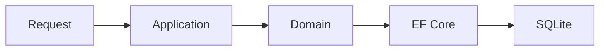

# O que mudou

## Adicionado

- Estrutura inicial da solution.
- Contexto de Usuários.
- Persistência SQLite com EF Core.
- ProblemDetails para exceções globais.
- Serilog e OpenTelemetry.
- Exportação OTLP via variáveis padrão `OTEL_*`, incluindo traces SQL para EF
  Core e SqlClient.
- Testes de entidades e serviços do domínio.
- Instrumentação OpenTelemetry para EF Core e SqlClient.
- Suporte a variáveis padrão `OTEL_*` para configuração do exporter OTLP.
- Scaffold inicial em `tools/scaffold` para geração de contextos.
- Dockerfiles independentes para API, Workers, Jobs, Consumers e MCP.

## Removido

- Artefatos de exemplo gerados pelo template padrão da API.

## Fluxos

