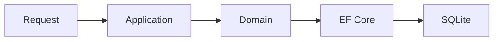

# O que mudou

## Adicionado

- Estrutura inicial da solution.
- Contexto de Usuários.
- Persistência SQLite com EF Core.
- ProblemDetails para exceções globais.
- Serilog e OpenTelemetry.
- Testes de entidades e serviços do domínio.

## Removido

- Artefatos de exemplo gerados pelo template padrão da API.

## Fluxos

