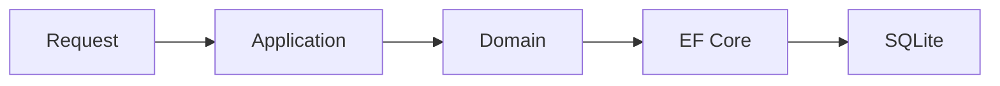

# O que mudou

## Adicionado

- Estrutura inicial da solution.
- Contexto de Usuários.
- Persistência SQLite com EF Core.
- ProblemDetails para exceções globais.
- Serilog e OpenTelemetry.
- Exportação OTLP via variáveis padrão `OTEL_*`, incluindo traces SQL para EF
  Core e SqlClient.
- Testes de entidades e serviços do domínio.
- Instrumentação OpenTelemetry para EF Core e SqlClient.
- Suporte a variáveis padrão `OTEL_*` para configuração do exporter OTLP.
- Scaffold inicial em `tools/scaffold` para geração de contextos.
- Dockerfiles independentes para API, Workers, Jobs, Consumers e MCP.
- Entrypoints de exemplo para Workers (`PeriodicTimer`), Jobs (Quartz) e
  Consumers (`Channel<UsuarioCriadoEvent>`), reutilizando o contexto de
  usuários sem regra de negócio nos apps.
- Job `DesativarUsuariosInativos` e Worker equivalente, com settings
  `Workers:IntervaloSegundos`, `Workers:DiasInatividade`, `Jobs:Cron` e
  `Jobs:DiasInatividade`.
- Migração inicial do EF Core (`20260930021318_InitialCreate`) e seed do
  usuário administrador na inicialização da API.
- Stack de observabilidade local em `tools/observability` (OpenTelemetry
  Collector, Loki, Tempo, Prometheus e Grafana) via Docker Compose.
- Exportação OTLP de logs (`OTEL_EXPORTER_OTLP_LOGS_ENDPOINT`), além de
  traces e métricas.
- `AddProjectSerilog` para registrar Serilog também nos apps não-HTTP.
- `launchSettings.json` para Workers, Jobs, Consumers e MCP.
- Documentação de arquitetura e de observabilidade em `docs/`.

## Alterado

- Registro de DI da API separado em `AddApiApplicationDependencies`, para que
  autenticação e Swagger não sejam registrados por Workers, Jobs e Consumers.
- `IPasswordService` movido de `AuthenticationConfiguration` para
  `ApplicationConfiguration`, desacoplando o hash de senha do setup de JWT.
- `NativeInjectorBootstrapper` reorganizado: dependências de aplicação,
  Swagger e autenticação aplicadas apenas no entrypoint da API.
- Estado atual do README passou a incluir Workers, Jobs e Consumers.

## Removido

- Artefatos de exemplo gerados pelo template padrão da API.
- Arquivo temporário `t.md` com anotação de comando de teste.

## Fluxos

```mermaid
flowchart LR
    A[Request] --> B[Application]
    B --> C[Domain]
    C --> D[EF Core]
    D --> E[SQLite]
```
